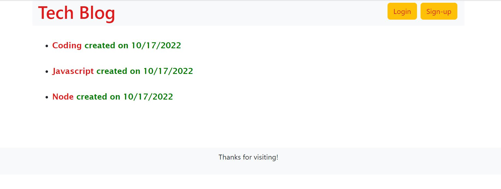

# Tech-blog
TECH BLOG is here !!

## Description
A professional Blog platform to read/create/edit/delete blogs and to comment on other creator's blogs!

## User story
### As a user:
Who writes about tech
I WANT a CMS-style blog site

### So that:
I can publish articles, blog posts, and my thoughts and opinions

## Table of Contents
* [Installation](#installation)
* [Usage](#usage)
* [Technologies used](#technologies-used)
* [License](#license)
* [Contribution](#contribution)
* [Screenshot](#screenshot)
* [Deployed Site](#deployed-site)
* [Questions](#questions)

## Installation
Please clone the repo to your local machine and do `npm i` to download the following packages:
* "bcrypt": "^5.0.1",
* "connect-session-sequelize": "^7.1.5",
* "dotenv": "^16.0.3",
* "express": "^4.18.1",
* "express-handlebars": "^6.0.6",
* "express-session": "^1.17.3",
* "handlebars": "^4.7.7",
* "mysql2": "^2.3.3",
* "sequelize": "^6.23.2"

## Usage
* A user is able to open the `tech blog` application and view existing blogs and comments by other users.
* The user can signup/login to create their own blogs and also comment on other blogs.

## Technologies used

## License

## Contribution
- [Jatin Saini](https://github.com/jatin1211)

## Screenshot

## Deployed Site
https://arcane-gorge-43584.herokuapp.com/

## Questions
Please email me with questions!
* sainijatin247@gmail.com
